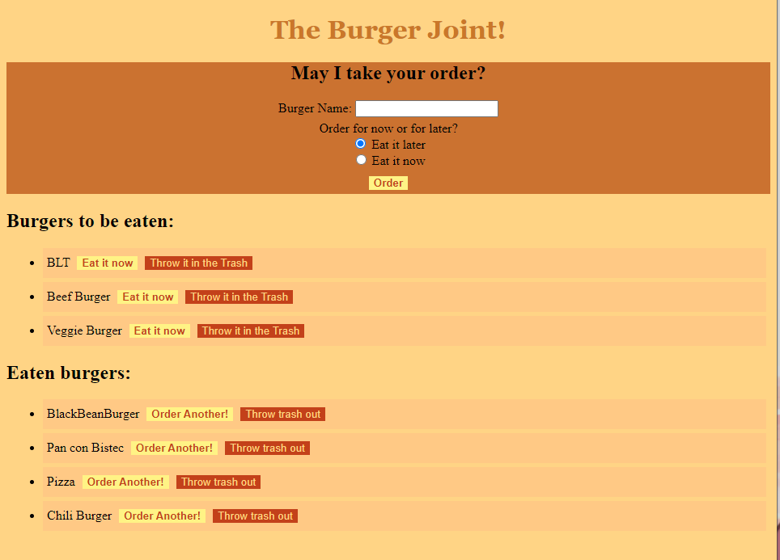

# The Burger Joint

## Description

This application is a virtual burger restaurant. You can order any burger you want (we also sell other things) and decide whether you want to eat it now or later. If you decide to eat it later, you can eat it whenever you want, or throw it away (for whatever reason). If you eat it now and decide that was too quick, you can order another one or just throw out your trash!

## Table of Contents

* [Installation](#installation)
* [Usage](#usage)
* [Credits](#credits)
* [Contributing](#contributing)
* [Tests](#tests)
* [License](#license)
* [Questions](#questions)

## Installation

npm i in the terminal will install all required packages for this app to work. Aside from the necessary packages, you will need to store your database somewhere (this app currently uses mySQL) and place your password (if necessary) to access such database.

## Usage

On the server/developper side, you can type in node server.js or npm start in the terminal for the app to be sent from the server to the webpage. Once on the app, you can type in whatever burger you would like, check if you want it now or later, and then order it. You can then decide whether to trash what you have, order another f you already ate it, or eat it now if you haven't.

Please follow the following link to the application!
[The Burger Joint](https://hidden-ravine-71551.herokuapp.com)

## Credits

The gracious TA's and Aliyah of BCS and group 2 for the support.

### Contributing

Hit me up or just clone the repo and do your thing!
        
### Tests

n/a
        
### Licenses

    GNU GPLv3

    Copyright (C) 2021  

    This program is free software: you can redistribute it and/or modify
    it under the terms of the GNU General Public License as published by
    the Free Software Foundation, either version 3 of the License, or
    (at your option) any later version.

    This program is distributed in the hope that it will be useful,
    but WITHOUT ANY WARRANTY; without even the implied warranty of
    MERCHANTABILITY or FITNESS FOR A PARTICULAR PURPOSE.  See the
    GNU General Public License for more details.

    You should have received a copy of the GNU General Public License
    along with this program.  If not, see <https://www.gnu.org/licenses>
    

### Questions

For any addiotional questions:

email me

github: [gabel35](https://github.com/gabel35)

email: GabrielJose3135@gmail.com
        

-------------

Thank you!

        